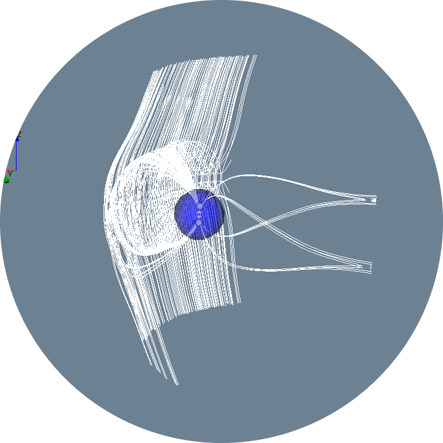

<p align="center">
  <a href="" rel="noopener">
 </a>
</p>

<h2 align="center">Vectorfield Topology Seeding Tool</h2>

---

<p align="center"> Finds, processes and visualizes critical points. Generates smart seedpoints to capture overall structure (VTK Python).
    <br> 
</p>

# About
This is a python based tool built on top of VTK that simplifies the vtkVectorFieldTopology flow and can be used to generate seedpoints around the given critical points or any custom points. This project is in collaboration with the Community Coordinated Modeling Center(CCMC) at NASA Goddard Space Flight Center and is used in the OpenSpace application. This tool can also be used to analyze and filter seedpoints based on where its fieldline hits Earth ('_IMF_', '_CLOSED_', '_OPEN_NORTH_', '_OPEN_SOUTH_'). Since this tool is built mainly to analyze the Earth's magnetosphere, some of the functions are tailored to that. However, this tool can be extended to other applications such as analyzing magnetic fields of the sun or even other planets. Some of the functionality might not be applicable just yet. 

There are two pipelines proposed, The [Critical Point-Based Pipeline](#quick-start-critical-point-based-pipeline), and the [Derived Field-Based Pipeline](/alternate_pipeline/README.md). This README is for the critical point based pipeline. The other is in [/alterante_pipeline](/alternate_pipeline/) directory.

# Getting started

Clone the repo
```bash
git clone https://github.com/PhilipNgo/vectorfield-topology-seeding-tool.git
cd vectorfield-topology-seeding-tool
```

Create a virtual environment (optional but recommended)
> Option 1:
```bash 
conda create --name <your-env-name> --file requirements.txt
conda activate <your-env-name>
```

> Option 2: (If the commands above doesn't work, we can manually install the dependencies)
```bash
conda create --name <your-env-name> python=3.9.2
conda activate <your-env-name>

# Dependencies
conda install numpy
conda install pandas
conda install vtk
```


# Quick Start: Critical Point-Based Pipeline

```python

from criticalpoint_processor.criticalpoint_processor import CriticalPointProcessor
from seedpoint_generator.seedpoint_generator import SeedpointGenerator, Template
from seedpoint_processor.seedpoint_processor import EarthSide, SeedpointProcessor, FieldlineStatus
from vectorfieldtopology.vectorfieldtopology import VectorFieldTopology
from vtk_visualization.helpers import start_window


def main():
    ####################### PART 1: Find critical points #############################

    filename = 'data/cut_mhd_2_e20000101-020000-000.dat'
    
    vft = VectorFieldTopology()
    vft.read_file(filename, rename_xyz=True)
    vft.update_vectorfield_from_scalars('B_x [nT]','B_y [nT]','B_z [nT]')
    vft.update_topology_object()
    vft.update_critical_points()
    vft.remove_critical_points_in_sphere(radius=3, center=(0,0,0))
    vft.save_critical_points_to_file()
    vft.update_list_of_actors(show_critical_points=True, show_separator=False, show_vectorfield=False)
    vft.visualize()
    

    ########################### PART 2: PROCESS CRITICAL POINTS ##########################
    cp_processor = CriticalPointProcessor()
    cp_processor.set_critical_points_info(vft.critical_points_info)
    cp_processor.filter_critical_points_by_types(['SADDLE_2_3D','SADDLE_1_3D'])
    cp_processor.update_list_of_actors()
    cp_processor.visualize()

    ########################## PART 3: GENERATE SEEDPOINTS ################################

    sp_generator = SeedpointGenerator()
    sp_generator.set_critical_point_info(cp_processor.critical_points_info)
    sp_generator.set_template(Template.SPHERICAL)
    sp_generator.update_seed_points()
    sp_generator.save_seed_points_to_file()
    sp_generator.visualize()
    
    # ######################### PART 4: PROCESS SEEDPOINTS ################################

    sp_processor = SeedpointProcessor()
    sp_processor.set_seed_critical_pair(sp_generator.seed_critical_pair)
    sp_processor.set_vector_field_domain(vft.vectorfield)
    sp_processor.update_seed_point_info()
    sp_processor.save_seed_point_info_to_file()
    sp_processor.save_seed_points_to_file() 
    sp_processor.visualize()
    sp_processor.visualize(side=EarthSide.DAYSIDE.value, status=FieldlineStatus.CLOSED.value)
    sp_processor.visualize(side=EarthSide.NIGHTSIDE.value, status=FieldlineStatus.CLOSED.value)

if __name__ == '__main__':
    main()
    
```


# Part 1: class VectorfieldTopology
| Class variables | Description |
| :--------- | :----------- |
| `critical_points` | List of critical point (x,y,z) coordinates|
| `critical_points_info` | List of critical point info dictionaries containing following keys: <br/> [`X`,`Y`,`Z`,`Gradient`,`Type`,`Type_text`, `Detailed_type`, `Detailed_type_text`]. <br/> Types and text are based on vtkVectorfielTopology types. Possible types and text combination: <table>  <thead>  <tr>  <th></th>  <th>Type</th>  <th>Text</th> <th></th> <th>Detailed Type</th> <th>Text</th>  </tr>  </thead>  <tbody>  <tr>  <td></td>  <td>-1</td> <td>DEGENERATE_3D</td> <td></td> <td>-1</td>  <td>DEGENERATE_3D</td>  </tr> <tr>  <td></td>  <td>0</td> <td>SINK_3D</td> <td></td> <td>0</td>  <td>ATTRACTING_NODE_3D</td>  </tr> <tr>  <td></td>  <td>1</td> <td>SADDLE_1_3D</td> <td></td> <td>1</td>  <td>ATTRACTING_FOCUS_3D</td>  </tr> <tr>  <td></td>  <td>2</td> <td>SADDLE_2_3D</td> <td></td> <td>2</td>  <td>NODE_SADDLE_1_3D</td>  </tr> <tr>  <td></td>  <td>3</td> <td>SOURCE_3D</td> <td></td> <td>3</td>  <td>FOCUS_SADDLE_1_3D</td>  </tr> <tr>  <td></td>  <td>4</td> <td>CENTER_3D</td> <td></td> <td>4</td>  <td>NODE_SADDLE_2_3D</td>  </tr> <tr>  <td></td>  <td></td> <td></td> <td></td> <td>5</td>  <td>FOCUS_SADDLE_2_3D</td>  </tr> <tr>  <td></td>  <td></td> <td></td> <td></td> <td>6</td>  <td>REPELLING_NODE_3D</td>  </tr> <tr>  <td></td>  <td></td> <td></td> <td></td> <td>7</td>  <td>REPELLING_FOCUS_3D</td>  </tr><tr>  <td></td>  <td></td> <td></td> <td></td> <td>8</td>  <td>CENTER_DETAILED_3D</td>  </tr> </tbody>  </table>  |
| `list_of_actors` | List of vtkActors that is used to render things to the screen.|
| `data_object` | A vtkUnstructuredGrid that is stored and loaded with read_file() function.  |
| `vectorfield` | A vtkImageData containing vector data.  |
| `topology_object` | The vtkVectorFieldTopology object containing topology values.  |
| `sphere_removed_actor` | Actor to illustrate Earth and where we remove the critical points from.  |


---
<br/><br/>

## **Functions**:

---
<br/>

### _read_file(filename, rename_xyz=False)_ 
Loads a .dat or .vtu file into class

| Parameters | Description |
| :--------- | :----------- |
| `filename` | Path to the .dat or .vtu file containing vectorfield data. |
| `rename_xyz` | Boolean if set True, renames the the variable header in the .dat file. Since the vtkTecplotReader requires the axis variable name to be 'X' / 'x' / 'I', 'Y' / 'y' / 'J', 'Z' / 'z' / 'K'.|

<br/>

### _update_vectorfield_from_scalars(scalar_name_x, scalar_name_y, scalar_name_z)_
Updates vectorfield
| Parameters | Description |
| :--------- | :----------- |
| `scalar_name_x` | Name of scalar component of the x value for the vectorfield.|
| `scalar_name_y` | Name of scalar component of the y value for the vectorfield.  |
| `scalar_name_z` | Name of scalar component of the z value for the vectorfield.  |

<br/>

### _update_vectorfield_from_vectors(vectorfield)_
Updates vectorfield
| Parameters | Description |
| :--------- | :----------- |
| `vectorfield` | Updates class variable with a given vectorfield (vtkImageData)|


<br/>

### _update_topology_object()_
Updates topology object class variable
| Description |
| :--------- | 
| Runs the vtkVectorFieldTopology update function that calculates the critical points and stores the result in the `topology_object` |

<br/>

### _update_critical_points()_
Updates critical_point and critical point info class variable
| Description |
| :--------- | 
| Updates the `critical_points` and `critical_points_info` variable based on the whats in the `topology object`. |

<br/>

### _remove_critical_points_in_sphere(radius, center)_
Removes critical point within a sphere with center x,y,z
| Parameters | Description |
| :--------- | :----------- |
| `radius` | Radius of sphere  |
| `center` | Center of sphere given in x,y,z  |


<br/>

### _save_critical_points_to_file()_
Saves critical points to file
| Description |
| :--------- | 
| Saves the `critical_points` as .txt and `critical_point_info` as .csv to directory "critical_points"  |

<br/>

### _update_list_of_actors(show_critical_points=True, show_separator=False, show_vectorfield=False)_
Updates list_of_actors class variable 
| Parameters | Description |
| :--------- | :----------- |
| `show_critical_points` | Boolean on wether to render the critical points |
| `show_separator` | Boolean on wether to render the separators |
| `show_vectorfield` | Boolean on wether to render the vectorfield  |

<br/>

### _visualize()_
Starts the visualization
| Description |
| :--------- | 
| Starts the rendering window and renders everything in the `list_of_actors` class variable. |

<br/>

# Part 2: class CriticalPointProcessor
| Class variables | Description |
| :--------- | :----------- |
| `critical_points` | List of critical point (x,y,z) coordinates|
| `critical_points_info` | List of critical point info dictionaries containing following keys: <br/> [`X`,`Y`,`Z`,`Gradient`,`Type`,`Type_text`, `Detailed_type`, `Detailed_type_text`]. <br/> Types and text are based on vtkVectorfielTopology types. Possible types and text combination: <table>  <thead>  <tr>  <th></th>  <th>Type</th>  <th>Text</th> <th></th> <th>Detailed Type</th> <th>Text</th>  </tr>  </thead>  <tbody>  <tr>  <td></td>  <td>-1</td> <td>DEGENERATE_3D</td> <td></td> <td>-1</td>  <td>DEGENERATE_3D</td>  </tr> <tr>  <td></td>  <td>0</td> <td>SINK_3D</td> <td></td> <td>0</td>  <td>ATTRACTING_NODE_3D</td>  </tr> <tr>  <td></td>  <td>1</td> <td>SADDLE_1_3D</td> <td></td> <td>1</td>  <td>ATTRACTING_FOCUS_3D</td>  </tr> <tr>  <td></td>  <td>2</td> <td>SADDLE_2_3D</td> <td></td> <td>2</td>  <td>NODE_SADDLE_1_3D</td>  </tr> <tr>  <td></td>  <td>3</td> <td>SOURCE_3D</td> <td></td> <td>3</td>  <td>FOCUS_SADDLE_1_3D</td>  </tr> <tr>  <td></td>  <td>4</td> <td>CENTER_3D</td> <td></td> <td>4</td>  <td>NODE_SADDLE_2_3D</td>  </tr> <tr>  <td></td>  <td></td> <td></td> <td></td> <td>5</td>  <td>FOCUS_SADDLE_2_3D</td>  </tr> <tr>  <td></td>  <td></td> <td></td> <td></td> <td>6</td>  <td>REPELLING_NODE_3D</td>  </tr> <tr>  <td></td>  <td></td> <td></td> <td></td> <td>7</td>  <td>REPELLING_FOCUS_3D</td>  </tr><tr>  <td></td>  <td></td> <td></td> <td></td> <td>8</td>  <td>CENTER_DETAILED_3D</td>  </tr> </tbody>  </table>  |
| `list_of_actors` | List of vtkActors that is used to render things to the screen.|

---
<br/><br/>

## **Functions**:

---
<br/>

### _load_critical_points_info(critical_points_info_filename)_ 
Loads a .csv data containing critical point info and updates `critical_point_info`.

| Parameters | Description |
| :--------- | :----------- |
| `critical_points_info_filename` | Path to the .csv file containing  the critical pointss info |

<br/>

### _set_critical_points_info(critical_points_info)_
Sets the critical_point_info class variable
| Parameters | Description |
| :--------- | :----------- |
| `critical_points_info` | List of critical point info dictionaries containing following keys: <br/> [`X`,`Y`,`Z`,`Gradient`,`Type`,`Type_text`, `Detailed_type`, `Detailed_type_text`]. |
<br/>

### _filter_critical_points_by_types(list_of_types)_
Filter critical points by types
| Description |
| :--------- | 
| Filter critical based on critical_point_info['Type_text']|
<br/>

### _filter_critical_points_by_detailed_types(list_of_detailed_types)_ 
Filter critical points by detailed types
| Description |
| :--------- | 
| Filter critical based on critical_point_info['Detailed_type_text']|
<br/>

### _update_list_of_actors()_
Updates list_of_actors class variable
| Description |
| :--------- | 
| Updates class variable `list_of_actors` based on information in the class|
<br/>

### _visualize()_
Starts the visualization
| Description |
| :--------- | 
| Starts the rendering window and renders everything in the `list_of_actors` class variable. |
<br/>

### _visualize_types(list_of_types)_
Starts the visualization with only certain type
| Parameters | Description |
| :--------- | :----------- |
| `list_of_types` | List of critical_point_info['Type_text'], can be any combination|
<br/>

### _visualize_detailed_types(list_of_types)_
Starts the visualization with only certain detailed type
| Parameters | Description |
| :--------- | :----------- |
| `list_of_types` | List of critical_point_info['Detailed_type_text'], can be any combination|
<br/>

### _save_critical_points_to_file()_
Saves critical points to file
| Description |
| :--------- | 
| Saves the `critical_points` as .txt and `critical_point_info` as .csv to directory "critical_points"|
<br/>


# Part 3: class SeedpointGenerator
| Class variables | Description |
| :--------- | :----------- |
| `critical_points` | List of critical point (x,y,z) coordinates|
| `gradient` | List of gradients given from critical points|
| `seed_points` | List of seed points (x,y,z) coordinates|
| `template` | Currently 3 working templates. `Template.SPHERICAL`,  `Template.TRIPPLE_EIGEN_PLANE`, `Template.SMART`|
| `seed_critical_pair` | List of critical point and their corresponding seed points|
| `list_of_actors` | List of vtkActors that is used to render things to the screen.|

---
<br/><br/>

## **Functions**:

---
<br/>

### _load_critical_points_info(critical_points_info_filename)_ 
Loads a .csv data containing critical point info and updates `critical_point_info`.
| Parameters | Description |
| :--------- | :----------- |
| `critical_points_info_filename` | Path to the .csv file containing  the critical pointss info |

### _set_template(template)_
Sets the template to seed
| Parameters | Description |
| :--------- | :----------- |
| `template` | Currently 3 working templates. `Template.SPHERICAL`,  `Template.TRIPPLE_EIGEN_PLANE`, `Template.SMART`.


### _set_custom_template(template_filename)_
Sets custom template based on user input
| Parameters | Description |
| :--------- | :----------- |
| `template_filename` | Path to the .txt file containing the template structure |

### _load_critical_points_info(critical_points_info_filename)_ 
Loads a .csv data containing critical point info and updates `critical_point_info`.

| Parameters | Description |
| :--------- | :----------- |
| `critical_points_info_filename` | Path to the .csv file containing  the critical pointss info |

<br/>

### _set_critical_points_info(critical_points_info)_
Sets the critical_point_info class variable
| Parameters | Description |
| :--------- | :----------- |
| `critical_points_info` | List of critical point info dictionaries containing following keys: <br/> [`X`,`Y`,`Z`,`Gradient`,`Type`,`Type_text`, `Detailed_type`, `Detailed_type_text`]. |
<br/>

### _set_custom_points(custom_points)_
Sets custom points by user
| Parameters | Description |
| :--------- | :----------- |
| `custom_points` | List of custom points of (x,y,z) data to seed around.|
<br/>

### _load_custom_points(custom_point_filename)_
Loads custom points set by user
| Parameters | Description |
| :--------- | :----------- |
| `custom_point_filename` | Path to file containing list of custom points of (x,y,z) data to seed around.|
<br/>

### _update_seed_points(is_custom_points)_
Updates the seedpoints
| Parameters | Description |
| :--------- | :----------- |
| `is_custom_points` | Boolean on wether to run a built in template or custom template |
<br/>

### _save_seed_points_to_file()_
Save the seed points .txt to directory "./seed_points"|
| Parameters | Description |
| :--------- | :----------- |
|  `filename` (optional) | Output filename, default is "seedpoints.txt"|

<br/>    
       
### _visualize()_
Starts the visualization
| Description |
| :--------- | 
| Starts the rendering window and renders everything in the `list_of_actors` class variable. |
<br/>    


# Part 4: class SeedpointProcessor
| Class variables | Description |
| :--------- | :----------- |
| `seedpoints` | List of seed points (x,y,z) coordinates|
| `seedpoint_info` | List of seed point info dictionaries containing following keys: <br/> [`X`, `Y`, `Z`, `EarthSide`, `FieldlineStatus`, `CriticalPoint`]. <br/> Where EarthSide and FieldlineStatus are calculated and can be the following: <table>  <thead>  <tr>  <th></th>  <th>EarthSide</th>  <th></th>  <th>FieldlineStatus</th> </tr>  </thead>  <tbody>  <tr> <td></td>  <td>DAYSIDE</td> <td></td> <td>IMF</td>  </tr> <tr> <td></td>  <td>NIGHTSIDE</td> <td></td> <td>CLOSED</td>  </tr> <tr> <td></td>  <td></td> <td></td> <td>OPEN_SOUTH</td>  </tr> <tr> <td></td>  <td></td> <td></td> <td>OPEN_NORTH</td>  </tr> </tbody>  </table>  |
| `seed_critical_pair` | List of critical point and their corresponding seed points|
| `list_of_actors` | List of vtkActors that is used to render things to the screen.|

---
<br/><br/>

## **Functions**:

---
<br/>

### _set_seed_critical_pair(seed_critical_pair)_
Sets the seed critical pair
| Parameters | Description |
| :--------- | :----------- |
| `seed_critical_pair` | List of seedpoints and their corresponding critical point |
<br/>

### _save_seed_points_to_file()_
Save the seed points to directory "./seed_points"
| Parameters | Description |
| :--------- | :----------- |
|  `filename` (optional) | Output filename, default is "seedpoints.txt"|
<br/>

### _save_seed_point_info_to_file(filename:)_
Save the seed point info to directory "./seed_points"
| Parameters | Description |
| :--------- | :----------- |
|  `filename` (optional) | Output filename, default is "seedpoints.csv"|
<br/>

### _update_seed_point_info()_
Updates seedpoint info
| Description |
| :--------- | 
| Updates `seedpoints_info` based on where the magnetic fieldline hits. Can be classified as : <table>  <thead>  <tr>  <th></th>  <th>EarthSide</th>  <th></th>  <th>FieldlineStatus</th> </tr>  </thead>  <tbody>  <tr> <td></td>  <td>DAYSIDE</td> <td></td> <td>IMF</td>  </tr> <tr> <td></td>  <td>NIGHTSIDE</td> <td></td> <td>CLOSED</td>  </tr> <tr> <td></td>  <td></td> <td></td> <td>OPEN_SOUTH</td>  </tr> <tr> <td></td>  <td></td> <td></td> <td>OPEN_NORTH</td>  </tr> </tbody>  </table>  |
<br/>

### _visualize(side, status)_
Starts the rendering window and renders everything in the `list_of_actors` class variable. 
| Parameters | Description |
| :--------- | :----------- |
| `side` (optional) | Filters based on side. Can be `NIGHTSIDE` or `DAYSIDE`|
| `status` (optional) | Filters based on status. Can be `IMF`, `CLOSED`, `OPEN_NORTH`, `OPEN_SOUTH`|
<br/>    


### _openspace_seeding(z_spacing, p, filename)_ 
Seed points specifically for OpenSpace since they require to be in a specific order.
| Parameters | Description |
| :--------- | :----------- |
| `z_spacing` (optional) | How much to increase the z-value in the `OPEN_NORTH` and `OPEN_SOUTH` seed points, default z_spacing = 0|
| `p` (optional) | Pull factor towards Earth,  default p = 0|
| `filename` (optional)| Output filename, default is "seedpoints_openspace.txt"|
<br/>    

### ~~_remove_useless_seed_points()_~~ (not fully functioning)


