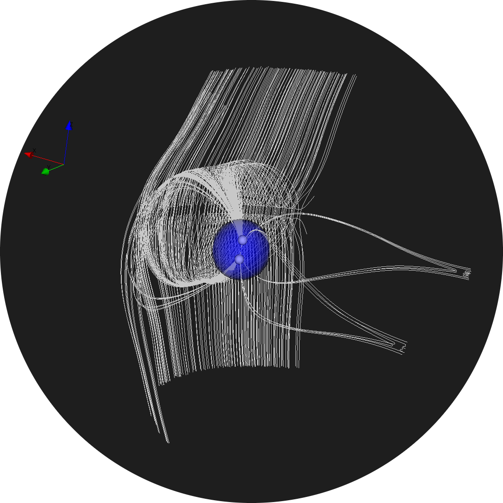

<p align="center">
  <a href="" rel="noopener">
 </a>
</p>

<h2 align="center">Vectorfield Analyzer Tool</h2>

<div align="center">

  []() 
  [](https://github.com/kylelobo/The-Documentation-Compendium/issues)
  [](https://github.com/kylelobo/The-Documentation-Compendium/pulls)
  [](/LICENSE)

</div>

---

<p align="center"> Finds, processes and visualizes critical points. Generates smart seedpoints to capture overall structure.
    <br> 
</p>


# Table of content
- Getting Started
- Examples
- Documentation
- Research

Clone the repo
```bash
git clone xx
cd xx

```

Create a virtual environment (optional but recommended)
```
$ conda create --name <env> --file requirements.txt
$ conda activate <env>
```
or with pip
```
python -m venv <env_name> 
. <env_name>/bin/activate
pip install -r requirements.txt
```

# About
This is a python based tool built on top of vtk that simplifies the vtkVectorFieldTopology flow and can be used to generate seedpoints. This tool can also be used to analyze and filter seedpoints based on where its fieldline hits Earth (IMF, CLOSED, OPEN-NORTH, OPEN-SOUTH). This tool is built mainly to analyze the Earths magnetosphere but can be extended to other applications. However, some of the functions are written primarily to study Earths magnetic field such as the "filter"-functions.

This project is in collabortaion with the Community Coordinated Modeling Center(CCMC) and is used in the OpenSpace application.


# Quick Start: End to end pipeline

```python
from seedpoint_generator_helper.seedpoint_generator import SeedpointGenerator, Template
from seedpoint_processor_helper.seedpoint_processor import EarthSide, SeedpointProcessor, FieldlineStatus
from vectorfieldtopology_helper.helpers import get_sphere_actor
from vectorfieldtopology_helper.vectorfieldtopology import VectorFieldTopology
from vtk_visualization_helper.helpers import start_window

def main():
    # # ###################### PART 1: Find critical points #############################

    filename = 'data/cut_mhd_2_e20000101-020000-000.dat'
    
    vft = VectorFieldTopology()
    vft.read_file(filename, rename_xyz=True)
    vft.update_vectorfield_from_scalars('B_x [nT]','B_y [nT]','B_z [nT]')
    vft.update_topology_object()
    vft.update_critical_points()
    vft.remove_critical_points_in_sphere(radius=3, center=(0,0,0))
    vft.save_critical_points_to_file()
    vft.update_list_of_actors(show_critical_points=True, show_separator=False, show_vectorfield=False)
    vft.visualize()


    # ########################## PART 2: GENERATE SEEDPOINTS ################################

    sp_generator = SeedpointGenerator()
    sp_generator.set_critical_point_info(vft.critical_points_info)
    sp_generator.set_template(Template.SPHERICAL)
    sp_generator.update_seed_points()
    sp_generator.save_seed_points_to_file()
    sp_generator.visualize()

    ######################### PART 3: PROCESS SEEDPOINTS ################################

    sp_processor = SeedpointProcessor()
    sp_processor.set_seed_critical_pair(sp_generator.seed_critical_pair)
    sp_processor.set_vector_field_domain(vft.vectorfield)
    sp_processor.update_seed_point_info()
    sp_processor.remove_useless_seed_points(level=0)
    sp_processor.filter_seeds(side=EarthSide.DAYSIDE, status=FieldlineStatus.IMF)
    sp_processor.save_seed_point_info_to_file()
    sp_processor.save_seed_points_to_file() 
    sp_processor.visualize()
   
if __name__ == '__main__':
    main()
   
    
```


# Part 1: class VectorfieldTopology
| Class variables | Description |
| :--------- | :----------- |
| `critical_points` | List of critical point (x,y,z) coordinates|
| `critical_points_info` | List of critical point info objects containing: x,y,z,gradient,type,type_text, detailed_type, detailed_type_text. Types and text are based on vtkVectorfielTopology types. Possible types and text combination: <table>  <thead>  <tr>  <th></th>  <th>Type</th>  <th>Text</th> <th></th> <th>Detailed Type</th> <th>Text</th>  </tr>  </thead>  <tbody>  <tr>  <td></td>  <td>-1</td> <td>DEGENERATE_3D</td> <td></td> <td>-1</td>  <td>DEGENERATE_3D</td>  </tr> <tr>  <td></td>  <td>0</td> <td>SINK_3D</td> <td></td> <td>0</td>  <td>ATTRACTING_NODE_3D</td>  </tr> <tr>  <td></td>  <td>1</td> <td>SADDLE_1_3D</td> <td></td> <td>1</td>  <td>ATTRACTING_FOCUS_3D</td>  </tr> <tr>  <td></td>  <td>2</td> <td>SADDLE_2_3D</td> <td></td> <td>2</td>  <td>NODE_SADDLE_1_3D</td>  </tr> <tr>  <td></td>  <td>3</td> <td>SOURCE_3D</td> <td></td> <td>3</td>  <td>FOCUS_SADDLE_1_3D</td>  </tr> <tr>  <td></td>  <td>4</td> <td>CENTER_3D</td> <td></td> <td>4</td>  <td>NODE_SADDLE_2_3D</td>  </tr> <tr>  <td></td>  <td></td> <td></td> <td></td> <td>5</td>  <td>FOCUS_SADDLE_2_3D</td>  </tr> <tr>  <td></td>  <td></td> <td></td> <td></td> <td>6</td>  <td>REPELLING_NODE_3D</td>  </tr> <tr>  <td></td>  <td></td> <td></td> <td></td> <td>7</td>  <td>REPELLING_FOCUS_3D</td>  </tr><tr>  <td></td>  <td></td> <td></td> <td></td> <td>8</td>  <td>CENTER_DETAILED_3D</td>  </tr> </tbody>  </table>  |
| `list_of_actors` | List of vtkActors that is used to render things to the screen.|
| `data_object` | A vtkUnstructuredGrid that is stored and loaded with read_file() function.  |
| `vectorfield` | A vtkImageData containing vector data.  |
| `topology_object` | The vtkVectorFieldTopology object containing topology values.  |
| `sphere_removed_actor` | Actor to illustrate Earth and where we remove the critical points from.  |


---
<br/><br/>

## **Functions**:

---
<br/>

### _read_file(filename, rename_xyz=False)_ 
Loads a .dat or .vtu file into class

| Parameters | Description |
| :--------- | :----------- |
| `filename` | Path to the .dat or .vtu file containing vectorfield data. |
| `rename_xyz` | Boolean if set True, renames the the variable header in the .dat file. Since the vtkTecplotReader requires the axis variable name to be 'X' / 'x' / 'I', 'Y' / 'y' / 'J', 'Z' / 'z' / 'K'.|

<br/>

### _update_vectorfield_from_scalars(scalar_name_x, scalar_name_y, scalar_name_z)_
Updates vectorfield
| Parameters | Description |
| :--------- | :----------- |
| `scalar_name_x` | Name of scalar component of the x value for the vectorfield.|
| `scalar_name_y` | Name of scalar component of the y value for the vectorfield.  |
| `scalar_name_z` | Name of scalar component of the z value for the vectorfield.  |

<br/>

### _update_vectorfield_from_vectors(vectorfield)_
Updates vectorfield
| Parameters | Description |
| :--------- | :----------- |
| `vectorfield` | Updates class variable with a given vectorfield (vtkImageData)|


<br/>

### _update_topology_object()_
Updates topology object class variable
| Description |
| :--------- | 
| Runs the vtkVectorFieldTopology update function that calculates the critical points and stores the result in the `topology_object` |

<br/>

### _update_critical_points()_
Updates critical_point and critical point info class variable
| Description |
| :--------- | 
| Updates the `critical_points` and `critical_points_info` variable based on the whats in the `topology object`. |

<br/>

### _remove_critical_points_in_sphere(radius, center)_
Removes critical point within a sphere with center x,y,z
| Parameters | Description |
| :--------- | :----------- |
| `radius` | Radius of sphere  |
| `center` | Center of sphere given in x,y,z  |


<br/>

### _save_critical_points_to_file()_
Saves critical points to file
| Description |
| :--------- | 
| Saves the `critical_points` as .txt and `critical_point_info` as .csv to directory "critical_points"  |

<br/>

### _update_list_of_actors(show_critical_points=True, show_separator=False, show_vectorfield=False)_
Updates list_of_actors class variable 
| Parameters | Description |
| :--------- | :----------- |
| `show_critical_points` | Boolean on wether to render the critical points |
| `show_separator` | Boolean on wether to render the separators |
| `show_vectorfield` | Boolean on wether to render the vectorfield  |

<br/>

### _visualize(self)_
Starts the visualization
| Description |
| :--------- | 
| Starts the rendering window and renders everything in the `list_of_actors` class variable. |

<br/>

## Part 2: class SeedpointGenerator

## Part 3: class SeedpointProcessor


The Optimized Route service provides a quick computation of time and distance between a set of location sources and location targets and returns them in an optimized route order, along with the shape.

[View an interactive demo](http://valhalla.github.io/demos/optimized_route)

## Part 1: class VectorfieldTopology 

You can request the following action from the Optimized Route service: `/optimized_route?`. Since an optimized route is really an extension of the *many_to_many* matrix (where the source locations are the same as the target locations), the first step is to compute a cost matrix by sending a matrix request.  Then, we send our resulting cost matrix (resulting time or distance) to the optimizer which will return our optimized path.

| Optimized type | Description |
| :--------- | :----------- |
| `optimized_route` | Returns an optimized route stopping at each destination location exactly one time, always starting at the first location in the list and ending at the last location. This will result in a route with multiple legs.  |

## Part 2: class SeedpointGenerator

The optimized route request run locally takes the form of `localhost:8002/optimized_route?json={}`, where the JSON inputs inside the `{}` includes location information (at least four locations), as well as the name and options for the costing model

Here is an example of an Optimized Route scenario:

Given a list of cities and the distances and times between each pair, a salesperson wants to visit each city one time by taking the most optimized route and end at a destination (either return to origin or a different destination).

```
{"locations":[{"lat":40.042072,"lon":-76.306572},{"lat":39.992115,"lon":-76.781559},{"lat":39.984519,"lon":-76.6956},{"lat":39.996586,"lon":-76.769028},{"lat":39.984322,"lon":-76.706672}],"costing":"auto","directions_options":{"units":"miles"}}
```

There is an option to name your optimized route request. You can do this by appending the following to your request `&id=`.  The `id` is returned with the response so a user could match to the corresponding request.

### Location parameters

A location must include a latitude and longitude in decimal degrees. The coordinates can come from many input sources, such as a GPS location, a point or a click on a map, a geocoding service, and so on. External search/geocoding services can be used to find places and geocode addresses, whose coordinates can be used as input to the service.

| Location parameters | Description |
| :--------- | :----------- |
| `lat` | Latitude of the location in degrees. |
| `lon` | Longitude of the location in degrees. |

Refer to the [route location documentation](/turn-by-turn/api-reference.md#locations) for more information on specifying locations.

### Costing parameters

The Optimized Route service uses the `auto`, `bicycle` and `pedestrian` costing models available in the Valhalla route service. The **multimodal costing is not supported** for the Optimized Route service at this time.  Refer to the [route costing models](/turn-by-turn/api-reference.md#costing-models) and [costing options](/turn-by-turn/api-reference.md#costing-options) documentation for more on how to specify this input.

### Other request options

| Options | Description |
| :------------------ | :----------- |
| `id` | Name your optimized request. If `id` is specified, the naming will be sent thru to the response. |

## Outputs of the optimized route service

If an optimized request has been named using the optional `&id=` input, then the name will be returned as a string `id`.

These are the results of a request to the Optimized Route service.

| Item | Description |
| :---- | :----------- |
| `optimized_route` | Returns an optimized route path from point 'a' to point 'n'.  Given a list of locations, an optimized route with stops at each intermediate location exactly one time, always starting at the first location in the list and ending at the last location.|
| `locations` | The specified array of lat/lngs from the input request.  The first and last locations in the array will remain the same as the input request.  The intermediate locations may be returned reordered in the response.  Due to the reordering of the intermediate locations, an `original_index` is also part of the `locations` object within the response.  This is an identifier of the location index that will allow a user to easily correlate input locations with output locations. |
| `units` | Distance units for output. Allowable unit types are mi (miles) and km (kilometers). If no unit type is specified, the units default to kilometers. |

## Error checking

The service checks the return to see that all locations can be reached. If one or more cannot be reached, it returns an error and lists the location number that cannot be reached.  Currently, one location is listed at this time, even if more than one have an issue.

This is an example which should return: `400::Location at index 3 is unreachable`

```
{"locations":[{"lat":40.306600,"lon":-76.900022},{"lat":40.293246,"lon":-76.936230},{"lat":40.448678,"lon":-76.932885},{"lat":40.419753,"lon":-76.999632},{"lat":40.211050,"lon":-76.777071},{"lat":40.306600,"lon":-76.900022}],"costing":"auto"}
```

See the [HTTP return codes](/turn-by-turn/api-reference.md#http-status-codes-and-conditions) for more on messages you might receive from the service.