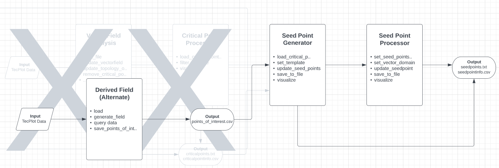
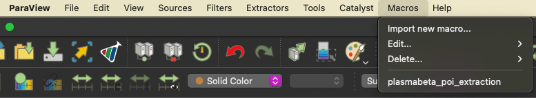

# About
This is the alternate pipeline that uses a derived field to generate seed points. This pipeline uses changes only the first part of the code and uses ParaView scripting in order for it to work. Download [ParaView](https://www.paraview.org/download/) and proceed with the following steps. (Working for ParaView 5.10.0)


# Getting started

Change the following lines in `/plasma_poi_extraction.py` (line 415-423)

```python

...

# Filenames, needs to be absolute path!
filename = 'ABSOLUTEPATH/YOUR_INPUT_FILENAME.dat'
outfile = 'ABSOLUTEPATH/YOUR_OUPUT_FILENAME.csv'
threshold = -12

```

1. Open ParaView → Macros → Import new macros.. 
2. Select `plasma_poi_extraction.py`
3. Run script and make sure a file with POIs is saved. <br> 

# Inserting into pipeline

```python
from criticalpoint_processor.criticalpoint_processor import CriticalPointProcessor
from seedpoint_generator.seedpoint_generator import SeedpointGenerator, Template
from seedpoint_processor.seedpoint_processor import EarthSide, SeedpointProcessor, FieldlineStatus
from vectorfieldtopology.vectorfieldtopology import VectorFieldTopology
from vtk_visualization.helpers import start_window


def main():
    ####################### PART 1: LOAD VECTORFIELD #############################

    # Dataset used
    dataset_filename = '<THE DATASET YOU USED>'
    path_to_poi = '<PATH TO THE POI EXTRACTED FROM THE PARAVIEW SCRIPT>'
    
    vft = VectorFieldTopology()
    vft.read_file(dataset_filename, rename_xyz=True)
    vft.update_vectorfield_from_scalars('B_x [nT]','B_y [nT]','B_z [nT]')

    ########################## PART 2: GENERATE SEEDPOINTS ################################

    sp_generator = SeedpointGenerator()
    sp_generator.load_custom_points(path_to_poi, every_nth=25)
    sp_generator.set_template(Template.SPHERICAL)
    sp_generator.update_seed_points()
    
    # ######################### PART 3: PROCESS SEEDPOINTS ################################
    sp_processor = SeedpointProcessor()
    sp_processor.set_seed_critical_pair(sp_generator.seed_critical_pair)
    sp_processor.set_vector_field_domain(vft.vectorfield)
    sp_processor.update_seed_point_info()
    sp_processor.save_seed_point_info_to_file()
    sp_processor.save_seed_points_to_file() 
    sp_processor.visualize()
    sp_processor.visualize(side=EarthSide.DAYSIDE.value, status=FieldlineStatus.CLOSED.value)
    sp_processor.visualize(side=EarthSide.NIGHTSIDE.value, status=FieldlineStatus.CLOSED.value)

if __name__ == '__main__':
    main()
   
```